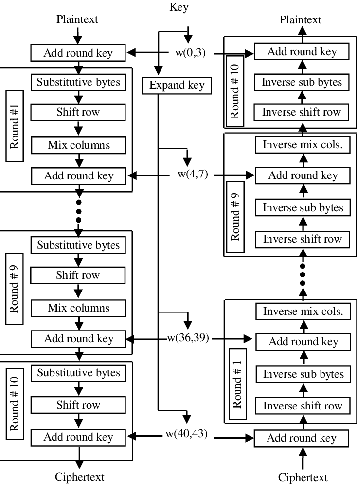

# 2.-FPGA_Based_AES_Cryptographic_Engine-

AES brief explanation:
In AES encryption there are two input and one output. The inputs are the 
key and the plaintext, while the output is the cipher text or the encrypted text. 
However, there is a key expansion block that expands the key and generate 10 
keys so that each one is used in a round either for encryption or decryption. After 
having the keys ready for all rounds then the rounds are executed. Initially, as a 
first step an add round key layer is executed. After that, 10 rounds are executed 
starting with Byte Substitution layer, Shift rows layer, Mix columns layer and 
ending with add round key layer. This procedure will be executed 9 times except 
that the final tenth round will be without mix columns layer. Then, the encrypted 
text is produced.

## Explanation:
The Advanced Encryption Standard (AES) specifies a FIPS-approved
cryptographic algorithm that can be used to protect electronic data. The AES algorithm is a
symmetric block cipher that can encrypt (encipher) and decrypt (decipher) information.
Encryption converts data to an unintelligible form called ciphertext; decrypting the ciphertext
converts the data back into its original form, called plaintext.
The AES algorithm is capable of using cryptographic keys of 128, 192, and 256 bits to encrypt
and decrypt data in blocks of 128 bits

## Block Diagram

## Outputs

